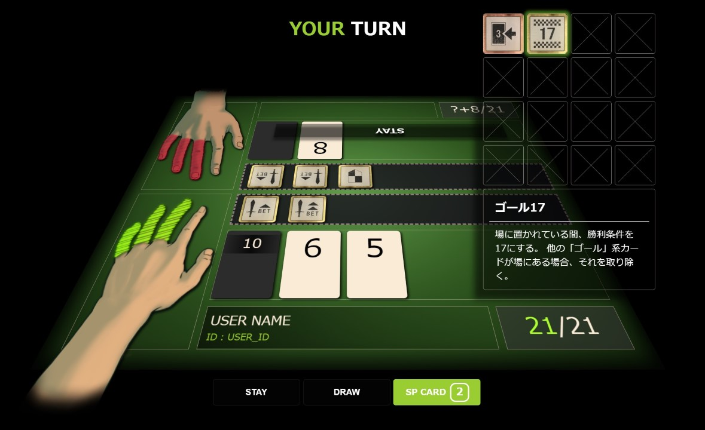

# 21 [【GAME START】](https://sotaro-ac.github.io/21)

**闇の《ブラックジャック》で遊ぼう！**
~~<small>某サバイバルホラーのミニゲームを再現！</small>~~

## ルール説明

1. **基本的にはブラックジャックと同じルールです！**
   - 山札から数字カードを引いて、手札の合計を【目標の数字】に近づけましょう。
   - ただし、【目標の数字】を超えてはいけません。
   - 【目標の数字】は通常「21」ですが、変動する場合があります！

2. **1～11のカードをそれぞれ１枚含む山札を共有します！**
   - 相手の１枚目の手札は伏せられていますが、同じ数字のカードは存在しないので予想がしやすくなります！

3. **お互いの5本の指を賭けて勝負します！**
   - 先に全て失った方の負けです。

4. **ゲームを有利にできる!?【スペシャルカード】が使えます！**
   - 好きな数字のカードを引いたり、【目標の数字】を変更したりできます！
   - 使い方次第で自分が不利になる場合もあります...

詳しくは[こちらを参照](https://sotaro-ac.github.io/21/rule.html)してください。

## ロードマップ

- [x] `ver.0.9.x` : パッシブSPカードをすべて実装
- [x] `ver.0.10.x` : SPカード効果をすべて実装
- [ ] `ver.0.11.x` : ゲームAIの強化（SPカードを使った戦略の追加。ルールベース）
- [ ] `ver.0.12.x` : SPカード使用時のアニメーション効果を追加
- [ ] `ver.0.13.x` : UIの全体的な改善（レスポンシブ対応など）

...

- [ ] `ver.1.0.x`  : リーダーボードの設置（WebStorage上に成績を保存）
- [ ] `ver.1.2.x`  : ゲームAIの強化（不完全情報ゲームを解くアルゴリズムの適用）

別進行でやりたい：
- ReactやVueを使ったSPA化
- ゲームのマッチング機能

## バージョン履歴

`ver.1.0.x` を達成後に記録する。

## 備考
- 画像素材は[yaakoo](https://github.com/yaakoo)に作成してもらった。
